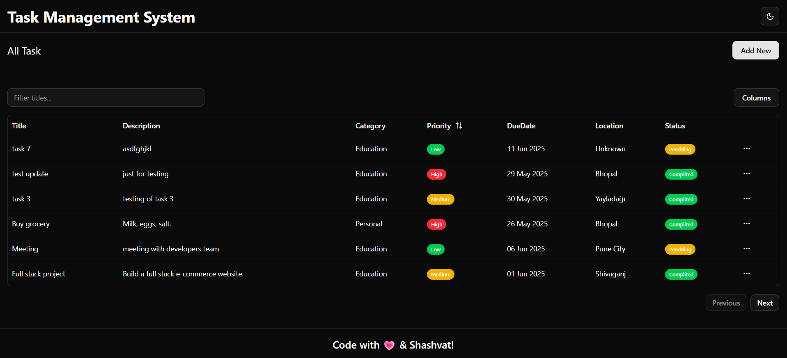
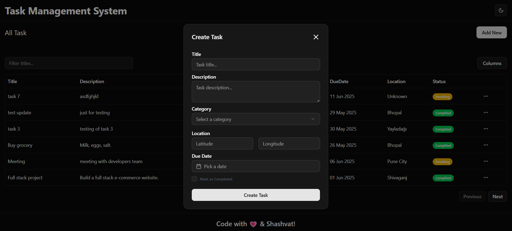
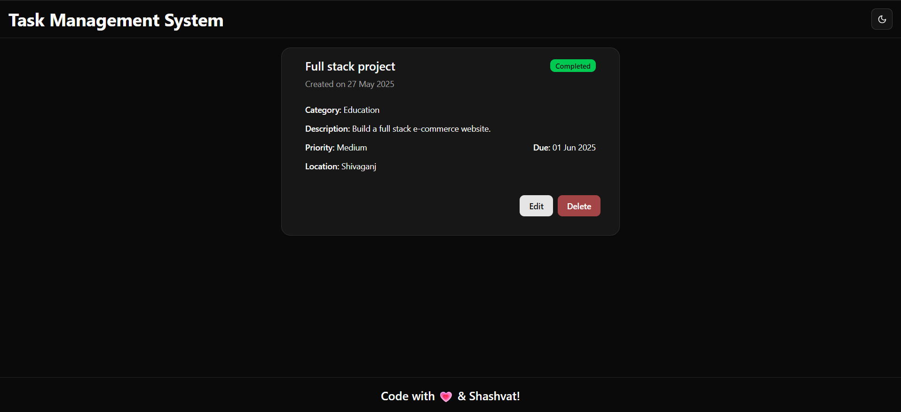
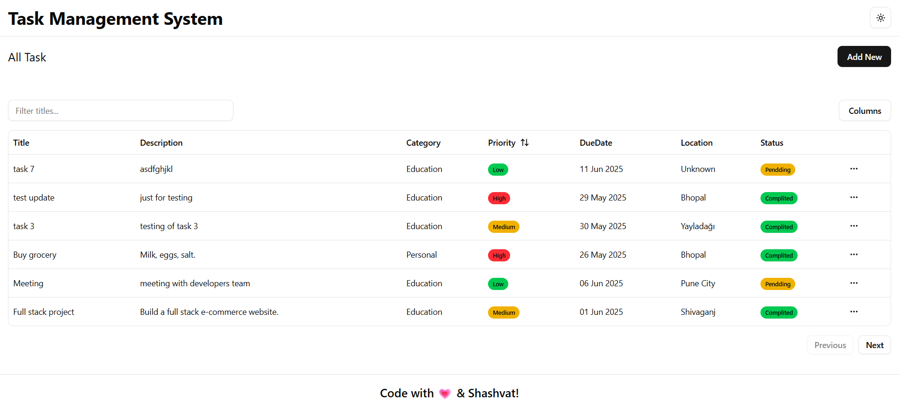

# 📋 Task Management System

A modern and responsive **Task Management System** built using the **MERN Stack (MongoDB, Express.js, React.js, Node.js)**. Styled with **Tailwind CSS** and powered by elegant **ShadCN UI components**, this system helps users create, track, and manage their tasks efficiently.

---

## 🚀 Tech Stack

| Technology   | Description                            |
| ------------ | -------------------------------------- |
| MongoDB      | NoSQL database for storing task data   |
| Express.js   | Backend framework for APIs             |
| React.js     | Frontend framework                     |
| Node.js      | Backend runtime                        |
| Tailwind CSS | Utility-first CSS framework            |
| ShadCN UI    | Modern, accessible React UI components |

---

## 🎯 Features

- ✅ Create, update, and delete tasks
- 📅 Set deadlines and priorities
- 🏷️ Categorize tasks with tags
- 🔔 Status indicators (Pending, In Progress, Completed)
- 💡 Responsive and clean UI with Tailwind + ShadCN
- 🌙 Light/Dark Mode toggle (optional with ShadCN)

---

## 📸 Screenshots






---

## 🛠️ Installation & Setup

### Backend (Express + MongoDB)

```bash
cd backend
npm install
npm start


add Collaborators anurag pune
```
